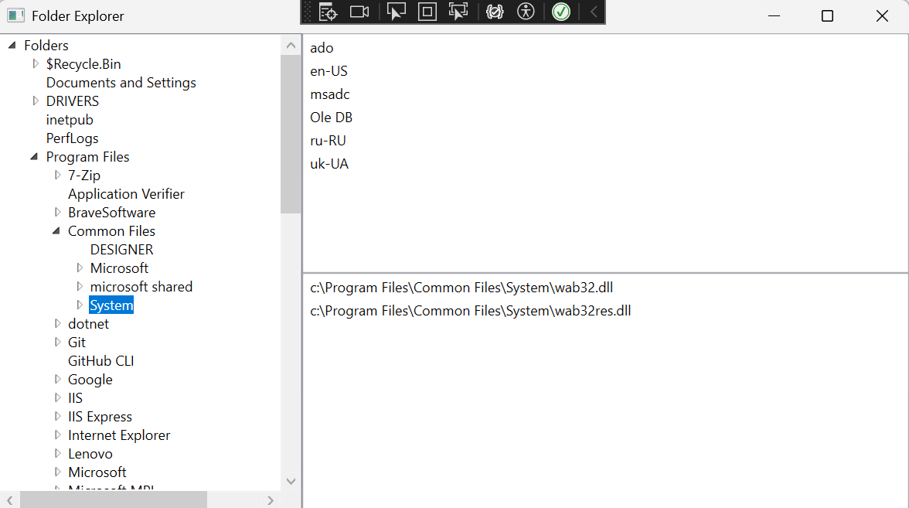

# WPF Demo App, based on Microsoft 's 2010 FolderExplorer VB.Net sample. 
I'm rewriting it with .Net 8.0 c# WPF

https://learn.microsoft.com/en-us/previous-versions/visualstudio/visual-studio-2010/bb546972(v=vs.100)

I put example file Folder.vb in this repo for reference. I translated it to C# as Folder.cs
Initially I used Microsoft Copilot (on 11/6/2025) to translate it, but translation was not perfect. 
Copilot don't know how to translate "If ... End If" to C# "if {...}" when there are several statements in between.

# Explanation of the code:

    xmlns:local="clr-namespace:WpfFileBrowser"

local:: Refers to the current project’s namespace (WpfFileBrowser), allowing you to use your own classes like Folder.

    <Window.Resources>
        <ObjectDataProvider x:Key="RootFolderDataProvider" >
            <ObjectDataProvider.ObjectInstance>
                <local:Folder FullPath="c:\"/>
            </ObjectDataProvider.ObjectInstance>
        </ObjectDataProvider>
        <HierarchicalDataTemplate 
            DataType    = "{x:Type local:Folder}"
            ItemsSource = "{Binding Path=SubFolders}">
            <TextBlock Text="{Binding Path=Name}" />
        </HierarchicalDataTemplate>
    </Window.Resources>

What this does:

Window.Resources: Declares reusable resources for the window.

ObjectDataProvider: Wraps a .NET object (Folder) so it can be used as a data source in XAML.

x:Key="RootFolderDataProvider": Gives the resource a name so it can be referenced in bindings.

<local:Folder FullPath="c:\"/>: Instantiates your custom Folder class with the root path C:\.